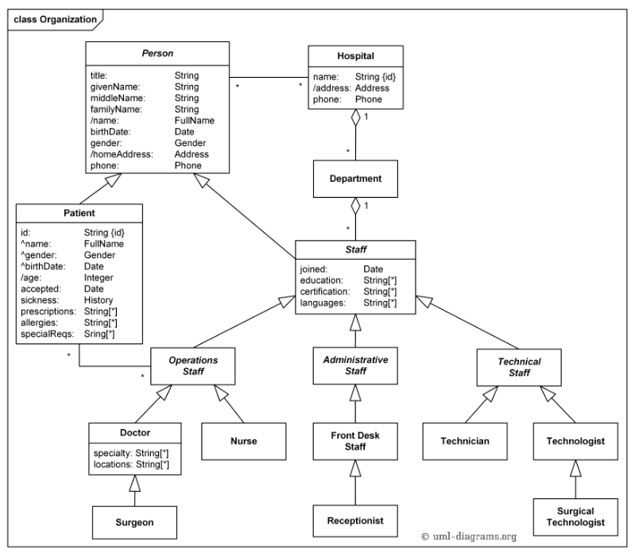

# Hospital Management System

This project is an implementation of a Hospital Management System in C++ using object-oriented principles and file system. It is based on a general UML diagram and includes various functionalities to manage and report on hospital data.

## Table of Contents

- [Project Description](#project-description)
- [Features](#features)
- [Class Diagram](#class-diagram)
- [Installation](#installation)
- [Reports](#reports)

## Project Description

The Hospital Management System is designed to simulate the operations of a hospital. It includes classes for persons, patients, staff, departments, and hospitals. The system allows for various reports and searches within the data, which is stored in memory to retain information across sessions.

## Features

- Implementation of all classes and their interface functions as shown in the UML diagram.
- Persistent in-memory storage of data.
- Ability to search across different classes.
- Various reports:
  - List of all technical staff who were sick before a given date.
  - List of patients who are hospital doctors.
  - List of doctors who are surgeons.
  - Report of doctors and nurses who are sick.
  - List of patients who were in the hospital during specific intervals.
  - Graphical representation of the types of diseases and their percentages among patients.
  - Percentage report of patients receiving admission based on specific criteria.
  - Percentage report of patients who are also doctors with a specific type of disease.

## Class Diagram

The following UML class diagram represents the structure of the system:



## Installation

1. Clone the repository:

   ```bash
   git clone https://github.com/Kiana8181/Hospital-Management-System.git

2. Navigate to the project directory

3. Compile the project using your preferred C++ compiler

## Reports

1. **Technical Staff Sick Before Date**: List all technical staff who were sick before a given date.
2. **Patients Who Are Doctors**: List all patients who are also hospital doctors.
3. **Doctors Who Are Surgeons**: List all doctors who are surgeons.
4. **Sick Doctors and Nurses**: Report of doctors and nurses who are sick.
5. **Patients During Intervals**: List all patients who were in the hospital during specific intervals.
6. **Disease Type Graph**: Graphical representation of the types of diseases and their percentages among patients.
7. **Admission Percentage**: Percentage of patients receiving admission based on specific criteria.
8. **Doctor Patients with Specific Disease**: Percentage report of patients who are also doctors with a specific type of disease.
